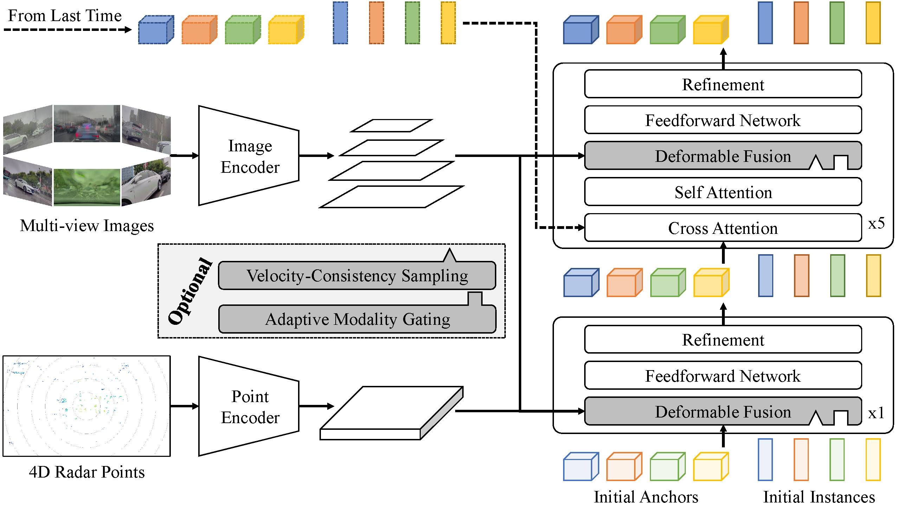

<div align="center">   
  
# Sparse4D-Radar: An Efficient and Robust Framework for Surround-View 3D Object Detection via 4D Radar-Camera Fusion
</div>

> [!NOTE]
> 
> **The complete code will be released after the paper is accepted. Please stay tuned.**

## Overall Framework
<center>
    
</center>

## OmniHD-Scenes Benchmark

### Results on Test Set
These experiments were conducted using 4 NVIDIA RTX A6000 GPUs with 48GB memory.

|        Model        | Modality |Image Res.|                                       Backbone                                       | mAP | ODS | mATE | mASE | mAOE | mAVE |                      config                      |                                                                               ckpt                                                                                |
|:-------------------:| :---: | :---: |:------------------------------------------------------------------------------------:| :---: | :---:| :---:|:---:|:---: | :---: |:------------------------------------------------:|:-----------------------------------------------------------------------------------------------------------------------------------------------------------------:|
| Sparse4D-Radar-Base |R+C|544x960|                                   R50+PointPillars                                   |47.01|57.25|0.4388|0.1981|0.3266| 0.3368 | [config](projects/configs/sparse4dradar_base.py) | [Google](https://drive.google.com/file/d/12ukTa2QYbZQ1Fa7Sv6bG9J2FT4WS7hsA/view?usp=drive_link)/[Baidu](https://pan.baidu.com/s/1wFl4iFtG__okudJYJUAMBw?pwd=cxbz) |
| Sparse4D-Radar-Acc  |R+C|544x960|                                  R50+PointPillars                                   | 47.57 |58.35 |0.4199 |0.1927 |0.3034 | 0.3187 | [config](projects/configs/sparse4dradar_acc.py)  |                                           [Google](https://drive.google.com/file/d/1hqxEIcVxxwhCfS09XkGTE5I0DpLKOknF/view?usp=sharing)/[Baidu](https://pan.baidu.com/s/1ONRat_w1_c9TK7-LfmWpfA?pwd=rmm8)                                            |

### Inference Speed and Computational Cost

These experiments were conducted using a single NVIDIA RTX 4090 GPU with 24GB memory.

|        Model        | Modality | Image Res. |     Backbone     | FPS  |  FLOPs  | Params |
| :-----------------: | :------: | :--------: | :--------------: | :--: | :-----: | :----: |
| Sparse4D-Radar-Base |   R+C    |  544x960   | R50+PointPillars | 11.5 | 472.06G | 53.47M |
| Sparse4D-Radar-Acc  |   R+C    |  544x960   | R50+PointPillars | 8.7  | 482.96G | 55.46M |


## Quick Start

### Create a new environment
```bash
conda create -n sparse4d_radar python=3.8 -y
conda activate sparse4d_radar
```

### Install packages
```bash
pip install torch==1.13.0+cu116 torchvision==0.14.0+cu116 torchaudio==0.13.0 --extra-index-url https://download.pytorch.org/whl/cu116
pip install -r requirement.txt
```

### Compile the CUDA op
```bash
cd ${project_path}
cd projects/mmdet3d_plugin/ops
python setup.py develop
```

### Prepare data
Download the [OmniHD-Scenes](https://github.com/TJRadarLab/OmniHD-Scenes) dataset and create symbolic links.
```bash
cd ${project_path}
mkdir data
ln -s path/to/OmniHD-Scenes data/OmniHD-Scenes
```
Generate the required .pkl files. You can also download from [Google](https://drive.google.com/drive/folders/16GIldjrwkmDBcr90jIl3ieFYa-xzzj3_?usp=sharing)/[Baidu](https://pan.baidu.com/s/12eYPRN3Ok6eiEwa1Pg6QRQ?pwd=kry4) if you don't want to generate them by yourself.
```bash
cd ${project_path}
mkdir -p data/omnihd_anno_pkls
python tools/omnihd_converter.py --version v1.0-trainval --info_prefix data/omnihd_anno_pkls/omnihd
```
Finally, you should have the following file structure:
```
data/
  omnihd/
    (200 data folders)...
    v1.0-trainval/
  omnihd_anno_pkls/
    omnihd_infos_train.pkl
    omnihd_infos_val.pkl
```

### Generate anchors by K-means
You can also download from [Google](https://drive.google.com/drive/folders/16GIldjrwkmDBcr90jIl3ieFYa-xzzj3_?usp=sharing)/[Baidu](https://pan.baidu.com/s/12eYPRN3Ok6eiEwa1Pg6QRQ?pwd=kry4) if you don't want to generate them by yourself.
```bash
cd ${project_path}
python tools/anchor_generator.py --ann_file data/omnihd_anno_pkls/omnihd_infos_train.pkl --detection_range 60 --output_file_name omnihd_kmeans900.npy
```

### Download pre-trained weights
```bash
cd ${project_path}
mkdir ckpt
wget https://download.pytorch.org/models/resnet50-19c8e357.pth -O ckpt/resnet50-19c8e357.pth
```

### Train
```bash
cd ${project_path}
bash ./tools/dist_train.sh ${config} ${gpu_num}
```

### Test
```bash
cd ${project_path}
python ./tools/test.py ${config} ${checkpoint} --eval bbox
```

## Acknowledgement
- [mmdet3d](https://github.com/open-mmlab/mmdetection3d)
- [Sparse4D](https://github.com/HorizonRobotics/Sparse4D)
- [OmniHD-Scenes](https://github.com/TJRadarLab/OmniHD-Scenes)
